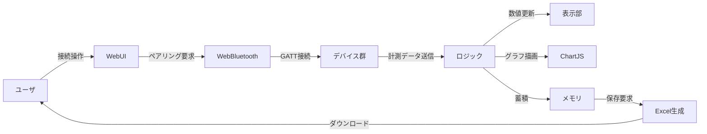

# VitSense
# MAX30102 & MLX90632 統合 Webアプリ仕様書

このドキュメントは，Web Bluetooth を用いて **MAX30102（心拍センサ）** と **MLX90632（赤外線温度センサ）** を接続・計測するアプリケーションの仕様とデータフローをまとめたものです．

---

## 1. 全体概要
- ブラウザ上で動作する Webアプリ
- **MAX30102**（右耳／左耳），**MLX90632**（右耳／左耳）の計4台をサポート
- データをリアルタイム表示（数値＋グラフ）し，Excel（.xlsx）でダウンロード可能

---

## 2. 機能仕様

### 接続
- ユーザは「接続」ボタンから各デバイスを選択してペアリング
- 接続完了するとデバイス名と状態が表示される
- デバイスが切断された場合は自動で未接続状態に戻り，計測中なら計測も停止する

### 計測開始・停止
- 4台すべて接続された時点で「計測開始」ボタンが有効化
- 押下で計測開始 → 各センサからのデータを受信し，グラフと数値を更新
- 再度押下で計測停止 → 受信処理を止める

### 表示内容
- **MAX30102（心拍センサ）**
  - 心拍数（BPM）
  - 移動平均BPM（直近4サンプル）
  - 経過時間（計測開始からの秒数）
  - データを受信した時刻（JST）
  - 装着状態（距離フラグ：正常／離れている）

- **MLX90632（温度センサ）**
  - 周囲温度（Ambient）
  - 対象物温度（Object）
  - 経過時間（計測開始からの秒数）
  - データを受信した時刻（JST）

### グラフ表示
- **MAX**：心拍数（BPM）の右／左を折れ線グラフで表示
- **MLX**：対象物温度（Object）の右／左を折れ線グラフで表示
- 最大50点までリアルタイムに更新（古い点は削除）

### データ保存
- 計測データはブラウザ上に蓄積
- 「一括ダウンロード」ボタンでExcelファイルを生成
  - シート構成：`MAX_R`, `MAX_L`, `MLX_R`, `MLX_L`
  - JST時刻付きで保存

---

## 3. データフロー図

---

## 4. 利用ライブラリ
- **Chart.js**: リアルタイム折れ線グラフ描画
- **SheetJS (xlsx.js)**: Excelファイル生成

---

## 5. 注意点
- デバイス名は Arduino 側で「MAX R」「MAX L」「MLX R」「MLX L」と設定すること
- 4台すべて接続されないと計測は開始できない
- データ保存はブラウザ上のみ（サーバ通信なし）

